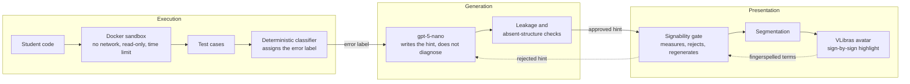

<div align="center">

# ProgSinais

**Programming feedback in Libras, generated by an LLM and verified for signability**

[](https://www.webmedia.org.br/)
[](LICENSE)
[](LICENSE-CONTEUDO)


</div>

> [!NOTE]
> This tool is described in the paper **"ProgSinais: uma ferramenta de feedback de programação em Libras com LLM e sinalizabilidade verificada"**, accepted at the **XXV Workshop de Ferramentas e Aplicações (WFA 2026)**, part of the **XXXII Brazilian Symposium on Multimedia and the Web (WebMedia 2026)**, Lavras/MG, Brazil.

ProgSinais is a web environment for Programming I exercises in Python, built for Deaf students. The student writes code in the browser, submits it, and receives the error diagnosis in simplified Portuguese plus progressive hints that never hand over the answer. Every text on the screen can be translated into Libras (Brazilian Sign Language) by the VLibras avatar, with the text highlighted sign by sign as the avatar signs it.

The repository is named `LLMSinais`, the project's working title.

---

## Table of contents

- [The problem](#the-problem)
- [What makes it different](#what-makes-it-different)
- [How it works](#how-it-works)
- [Four-level hints](#four-level-hints)
- [Measured results](#measured-results)
- [Getting started](#getting-started)
- [Reports](#reports)
- [Project structure](#project-structure)
- [Known limitations](#known-limitations)
- [Roadmap](#roadmap)
- [How to cite](#how-to-cite)
- [License](#license)

---

## The problem

In Brazilian bilingual Deaf education, Libras and written Portuguese are both languages of instruction, and Portuguese is taught as a second language. Learning to program adds two more layers:

- **Interpreter messages arrive in technical English.** A hearing student reads a hard message. A Deaf student reads a hard message, in a foreign language, inside another language that is not their first.
- **Most computing terms have no established sign in Libras.** Initiatives that teach programming to Deaf students have had to create their own glossaries.

Sending that text to an automatic translator is not enough. When a term has no sign, the avatar **falls back to fingerspelling**, spelling I-N-P-U-T letter by letter. Worse, our instrumentation recorded cases of **silent semantic corruption**: `range` received the sign for *ranger* (to grind one's teeth) and `File` the sign for *filar* (to scrounge). The student sees a well formed sign that has nothing to do with the concept, with no warning that the translation failed.

## What makes it different

Existing work covers pieces of this problem, but not the whole chain:

| | Runs the code | Diagnoses the error | LLM feedback | Delivered in Libras | Checks signability |
|---|:---:|:---:|:---:|:---:|:---:|
| LLM programming assistants (CodeHelp, CodeAid) | ✅ | ✅ | ✅ | ❌ | ❌ |
| Brazilian tools for Deaf students (glossaries, Proglib/Hands, video lessons) | partial | ❌ | ❌ | commands only | ❌ |
| Sign language translators (VLibras) | ❌ | ❌ | ❌ | ✅ | ❌ |
| **ProgSinais** | ✅ | ✅ | ✅ | ✅ | ✅ |

Two contributions set ProgSinais apart:

1. **Signability gate.** Signability is not requested from the model, it is verified. Every model-generated hint is measured before it is shown; what would fall into fingerspelling is rejected and regenerated, and the gate learns from the terms the avatar actually fingerspelled at run time.
2. **Sign-by-sign synchronization.** The highlight follows the sign currently being performed, not the paragraph, so the student can connect each sign to the written word.

## How it works



**The LLM never decides whether the code is right.** Test cases and a deterministic classifier do that. The model only writes the explanation for a diagnosis that already exists, which narrows the room for hallucination.

**The model call.** Each hint is one call to `gpt-5-nano` through the Chat Completions API, with `reasoning_effort: low` and a 2,500 token ceiling. The system message sets the writing rules (at most four sentences of up to twelve words, direct word order, at most one English term) and carries only the rule for the requested level. The user message sends, in labeled fields, the problem statement, the student's code, the error label, the raw interpreter message, the failing test case, and the student's recurring errors.

**Linguistic accessibility.**

- **Displayed text and signed text are different things.** The student reads "The `input` command waits for the person to type", because they need to learn the term; the avatar receives "A special command waits for the person to type", which does not fall into fingerspelling.
- **Signability gate.** A sentence over 12 words, a symbol with no sign, or a term from the lexicon of unsigned terms rejects the hint and triggers a new generation with the problematic terms named in the request. If the rejection persists, the version with the best index wins, since an imperfect hint still teaches.
- **A lexicon that learns from the translator.** The avatar's output is intercepted at run time. Every term the avatar fingerspells is added to the lexicon and blocked in the next generations.
- **Two levels of synchronization.** The sentence segment is the unit the student controls; inside it, the highlight follows each sign, matching gloss and text by common word stem.
- **A glossary per exercise**, with each term in code font and a translatable explanation next to it.

**Safe execution.** Student code runs in a disposable container with `--network none`, `--read-only`, `--init`, memory and process limits, a small `tmpfs`, and a hard timeout, so an infinite loop comes back as a timeout instead of freezing the app. The application server never executes student code.

**No sign-up.** Students are identified by an anonymous session UUID, so the platform can be used right away.

## Four-level hints

The student asks for help as many times as needed, up to four levels. Each level sends the model only its own rule; describing all four at once made the model reveal the fix in the very first hint.

| Level | What it reveals |
|:---:|---|
| 1 | where to look, without saying why |
| 2 | the concept behind the error, without quoting the student's code |
| 3 | one verification strategy |
| 4 | the fix for that specific snippet, never the whole program |

When a student repeats the same kind of error within the same concept, the hint adds a sentence that teaches a habit to avoid it. The model receives the already classified error type, never the raw history, and is not allowed to describe past attempts.

Deterministic checks run on every generated hint: one rejects solution leakage (in code or in prose that gives the fix away), another rejects hints that mention structures missing from the student's code, and the third is the signability gate.

## Measured results

The instrumentation runs inside normal use, so the tool can measure itself without participants. Current values:

| Measurement | Value |
|---|---:|
| Signability, raw interpreter message | 0.25 |
| Signability, simplified error | 0.83 |
| Lexicon seed (Programming I terms) | 46 |
| Signs fingerspelled by the avatar | 4 of 24 |
| Tokens per hint | 1,607 |
| Cost per thousand hints | US$ 0.36 |
| Exercises / test cases in the track | 9 / 27 |

> [!IMPORTANT]
> These numbers come from a small base collected during development. They characterize the instrument and **do not measure learning**. The signability values are estimated by the verifier, the raw message is in English, and the delivered text is selected by the index itself, so the contrast is not a controlled comparison.

The track covers variables, conditionals, loops (`for` and `while`), accumulators, lists, strings, and functions, one new concept per exercise.

## Getting started

**Requirements:** PHP 8.3, Composer, Node 22, Docker, and an OpenAI API key (only the hints need it; everything else works without one).

```bash
git clone https://github.com/Wyllgner/LLMSinais.git
cd LLMSinais

composer install
npm install
cp .env.example .env
php artisan key:generate

# set OPENAI_API_KEY in .env

docker pull python:3.11-alpine

php artisan migrate --seed
npm run build
php artisan serve
```

The user running `php artisan serve` must belong to the `docker` group.

**Main settings in `.env`:**

| Variable | Default | Purpose |
|---|---|---|
| `OPENAI_MODEL` | `gpt-5-nano` | model used for hints and error simplification |
| `OPENAI_REASONING_EFFORT` | `low` | `minimal` truncated hints and revealed the fix too early |
| `OPENAI_MAX_TOKENS` | `2500` | reasoning tokens count toward this limit |
| `SANDBOX_IMAGE` | `python:3.11-alpine` | image used to run student code |
| `SANDBOX_TIMEOUT` | `5` | seconds before a run is killed |
| `SANDBOX_MEMORY` | `128m` | memory limit per run |
| `OPENAI_PRECO_ENTRADA` / `OPENAI_PRECO_SAIDA` | | price per million tokens, used by the cost report |

## Reports

```bash
php artisan relatorio:custo             # tokens and cost per generated hint
php artisan relatorio:sinalizabilidade  # predicted index vs. measured fingerspelling
```

The second report compares the index the verifier predicted with what the avatar actually did, and lists the most fingerspelled terms. Fill in `OPENAI_PRECO_ENTRADA` and `OPENAI_PRECO_SAIDA` for the cost report to show dollar values.

## Project structure

Laravel 13 with Blade and Tailwind 4, SQLite, and framework-free JavaScript.

| Layer | Location |
|---|---|
| Isolated execution | `app/Services/SandboxService.php` |
| Grading by test cases | `app/Services/CorretorService.php` |
| Error classification | `app/Services/ClassificadorErro.php` |
| Hint generation and model call | `app/Services/FeedbackService.php` |
| Signability check | `app/Services/SinalizabilidadeService.php` |
| Lexicon of unsigned terms | `app/Services/LexicoSinais.php` |
| Segmentation for translation | `app/Services/SegmentadorService.php` |
| Student progress | `app/Services/ProgressoService.php` |
| Avatar synchronization | `resources/js/vlibras-sync.js`, `resources/js/glosa.js` |
| Translation measurement | `resources/js/medicao.js` |
| Exercise track | `database/seeders/ExerciseSeeder.php` |

The code base and the interface are in Portuguese, since the target audience is Brazilian.

## Known limitations

- **Not yet evaluated with Deaf students.** This is the main limitation. No signer took part in the design, the lexicon, the paraphrases, or the calibration of the index, and on Deaf readers' preferences, the ones who answer are Deaf readers.
- **Leakage containment is verified, not guaranteed.** The checks recognize wordings already observed; new ones may slip through.
- **The lexicon only grows.** A term fingerspelled because of a transient failure stays blocked.
- **The classifier's accuracy has not been measured** against human labeling, and the whole chain depends on its label.
- **The index is a process proxy.** It evaluates the text before translation and does not measure comprehension of the produced sign.
- **VLibras has documented limitations,** such as the lack of facial and body expressions, and regional sign variation. It is a complementary layer, not a guarantee of accessibility.
- **Word to sign alignment is heuristic,** based on common stems. It works well on short sentences with everyday vocabulary, which is what the system generates.
- **Blocking VLibras click capture relies on an internal detail of the widget.** A future version may change it.
- **Problem statement, code, and error are sent to the OpenAI API,** so the tool should only be used with non-sensitive data until a local model replaces that service.
- **Automated test coverage is minimal;** most validation was manual.

## Roadmap

- [ ] Co-design the lexicon, paraphrases, and gate thresholds with signers and Libras interpreters with a computing background
- [ ] Submit an evaluation protocol with Deaf students to a research ethics committee
- [ ] Class-scale pilot in a federal institute or bilingual school
- [ ] Support a locally hosted model, removing recurring cost and third-party data transfer
- [ ] Release an open corpus of programming errors paired with a simplified Portuguese diagnosis, Libras gloss, and translation failure annotations
- [ ] Validate hints with a second model

## How to cite

If you use ProgSinais in your research, please cite:

```bibtex
@inproceedings{amorim2026progsinais,
  author    = {Wyllgner Fran{\c c}a de Amorim and J{\'a}der Louis de S. Gon{\c c}alves and
               Lucas Marques da Cunha},
  title     = {{ProgSinais}: uma ferramenta de feedback de programa{\c c}{\~a}o em Libras
               com {LLM} e sinalizabilidade verificada},
  booktitle = {Anais Estendidos do XXXII Simp{\'o}sio Brasileiro de Sistemas Multim{\'i}dia
               e Web (WebMedia 2026), XXV Workshop de Ferramentas e Aplica{\c c}{\~o}es (WFA)},
  address   = {Lavras/MG, Brasil},
  publisher = {Sociedade Brasileira de Computa{\c c}{\~a}o},
  year      = {2026}
}
```

## Authors

- **Wyllgner França de Amorim**, Federal University of Paraná (UFPR)
- **Jáder Louis de S. Gonçalves**, University of São Paulo (USP)
- **Lucas Marques da Cunha**, Federal University of Rondônia (UNIR)

## License

- Code: **MIT** ([`LICENSE`](LICENSE))
- Pedagogical content (exercises, examples, glossary): **CC BY-SA 4.0** ([`LICENSE-CONTEUDO`](LICENSE-CONTEUDO))

VLibras is a service of the Brazilian Federal Government and is not part of this repository; it is loaded from `vlibras.gov.br`.
